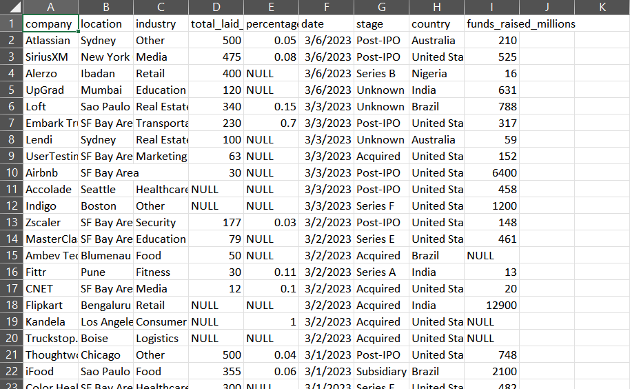
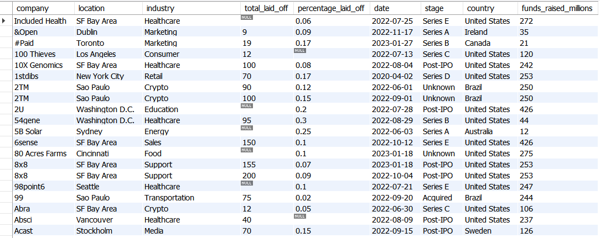
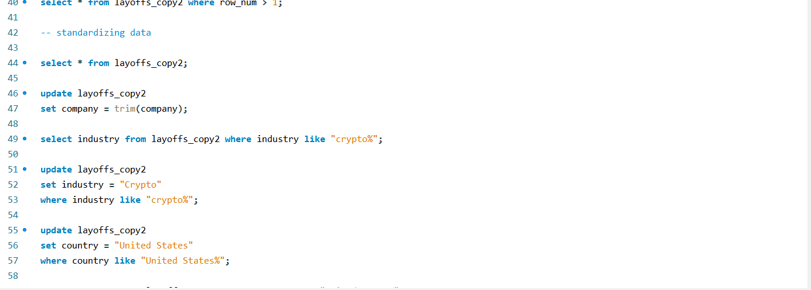
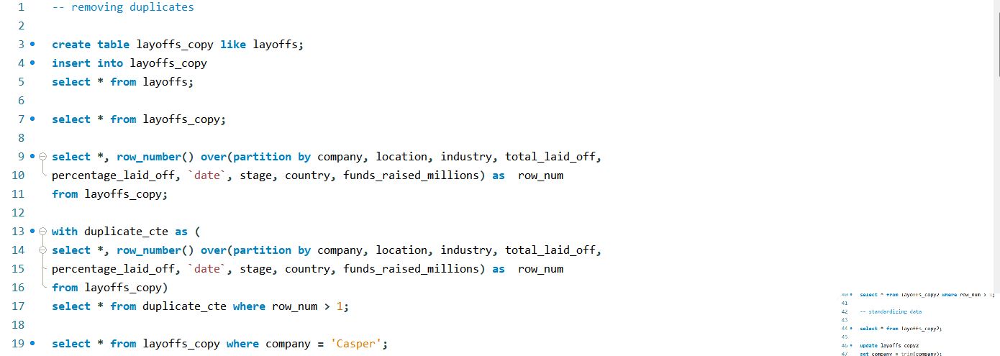

📌 Overview

In this project, I worked with a layoffs dataset containing messy, inconsistent, and duplicate records. The goal was to clean and standardize the data using SQL so it can be used for analysis or reporting.

🛠️ What I Did

Created a staging copy of the raw dataset to avoid modifying original data
Identified and removed duplicates using ROW_NUMBER() with window functions
Standardized text fields:
Trimmed company names
Unified inconsistent values (e.g., "crypto" → "Crypto")
Fixed country naming inconsistencies
Converted date format from text to proper DATE type
Handled missing values:
Replaced blank values with NULL
Filled missing industry values using self-join logic
Removed irrelevant rows where both layoff metrics were missing
Dropped helper columns after cleaning

⚙️ Technologies Used

SQL (MySQL)
Window Functions (ROW_NUMBER)
CTEs (Common Table Expressions)
Data Cleaning Techniques

📊 Key Insights

Real-world datasets are often messy and require multiple cleaning steps before analysis
Window functions are powerful for detecting duplicates
Standardizing categorical data is critical for accurate grouping and analysis
Handling NULLs properly can significantly improve data quality

